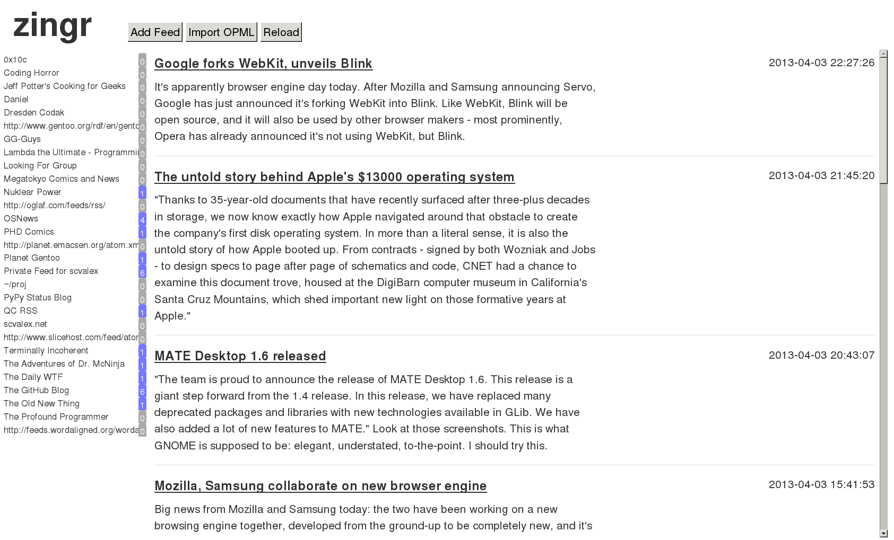

zingr
=====

> zingr is not google reader

What
====

This is a standalone, single user, web-based news aggregator.  Think
of it as your own personal Google Reader.  I wrote it to see how hard
it would be (it wasn't very, and took about
[nine hours and a half](todo.org) to code).  A description of the code
and of some of the design decisions are in this
[blog post][scvalex:23].

[scvalex:23]: http://www.scvalex.net/posts/23/

Dependencies
------------

The only external dependency is `feedparser`.
